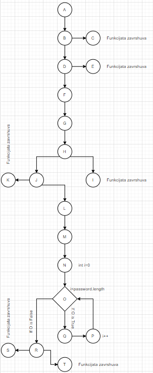

<h1>Втора лабораториска вежба по Софтверско инженерство</h1>

<h2>Борис Џотов, бр. на индекс 185022</h2>

<h3>Група на код:</h3>

Ја добив групата на код 3

<h3>Control Flow Graph</h3>

<h3>Цикломатска комплексност</h3>
Цикломатската комплексност на овој код е 6, истата ја добив преку формулата P+1, каде што Р е бројот на предикатни јазли.
Во случајов Р=5, па цикломатската комплексност изнесува 5+1=6.

<h3>Тест случаи според критериумот Multiple condition</h3>

Multiple condition nodes: <strong>D & R</strong>

<table style="border-width: 1px; text-align: center">

<tr>
<td><strong>Node</strong></td>
<td><strong>True</strong></td>
<td><strong>False</strong></td>
</tr>

<tr>
<td><strong>D</strong></td>
<td>T || T; T || F; F || T</td>
<td>F || F</td>
</tr>

<tr>
<td><strong>R</strong></td>
<td>F || F || T; F || T || F; F || T || T; T || F || F; T || F || T; T || T || F; T || T || T; </td>
<td>F || F || F </td>
</tr>
</table>

<h3>Тест случаи според критериумот Every statement</h3>

Every statement nodes: <strong>B, D, H, J, R</strong>

<table style="border-width: 1px">

<tr>

<td><strong>Node</strong></td>
<td><strong>True</strong></td>
<td><strong>False</strong></td>
</tr>

<tr>
<td><strong>B</strong></td>
<td>user == null</td>
<td>user != null</td>
</tr>

<tr>
<td><strong>D</strong></td>
<td>T || T; T || F; F || T</td>
<td>F || F</td>
</tr>

<tr>
<td><strong>H</strong></td>
<td>pasword.contains(user.getUsername().toLowerCase))) = T</td>
<td>pasword.contains(user.getUsername().toLowerCase))) = F</td>
</tr>

<tr>
<td><strong>J</strong></td>
<td>passwordLower.length() < 8</td>
<td>passwordLower.length() > 8</td>
</tr>

<tr>
<td><strong>Q1</strong></td>
<td>T</td>
<td>F</td>
</tr>

<tr>
<td><strong>Q2</strong></td>
<td>T</td>
<td>F</td>
</tr>

<tr>
<td><strong>Q3</strong></td>
<td>T</td>
<td>F</td>
</tr>

<tr>
<td><strong>R</strong></td>
<td>F || F || T; F || T || F; F || T || T; T || F || F; T || F || T; T || T || F; T || T || T; </td>
<td>F || F || F </td>
</tr>

</table>

<h3>Објаснување на напишаните unit tests</h3>
<h4>Критериум: Multiple condition</h4>

Кај јазелот <i>D</i> - <b>if (user.getUsername()==null || user.getPassword()==null)</b>, се проверуваат две работи. Прво ако корисникот нема внесено корисничко име, а потоа ако корисникот нема внесено лозинка, во тој случај се фрла исклучок со порака <i>The user is missing some mandatory information</i> и програмата прекинува. Ако и двата услова се неточни програмата продолжува понатаму.

Кај јазелот <i>R</i> - <b>if (!digit || !upper || !special)</b>, се проверуваат променливите од претходниот јазел дали има некоја со вредност <i>false</i>, ако има, функцијата враќа <i>false</i> и програмата прекинува, ако нема враќа <i>true</i> и тоа е крајот на функцијата.

<h4>Критериум: Every statement</h4>

Кај јазелот <i>В</i> - <b>if (user==null)</b>, се проверува дали профилот на корисникот постои или не. Ако профилот постои се продолжува понатаму во кодот, ако не постои се фрла исклучок со порака <i>The user is not instantiated</i> и програмата прекинува.

Кај јазелот <i>D</i> - <b>if (user.getUsername()==null || user.getPassword()==null)</b>, се проверуваат две работи. Прво ако корисникот нема внесено корисничко име, а потоа ако корисникот нема внесено лозинка, во тој случај се фрла исклучок со порака <i>The user is missing some mandatory information</i> и програмата прекинува. Ако и двата услова се неточни програмата продолжува понатаму.

Кај јазелот <i>H</i> - <b>if (passwordLower.contains(user.getUsername().toLowerCase()))</b>, се проверува дали лозинката што ја внел корисникот е иста со корисничкото име. Ако се исти враќа <i>false</i> и програмата завршува, ако не се исти продолжува во следниот if-statement.

Кај јазелот <i>J</i> - <b>else if (passwordLower.length()<8)</b>, ако претходниот услов не е исполнет програмата го проверува овоја услов - дали должината на внесената лозинка е помала од 8. Ако е помала враќа <i>false</i>, ако не е продолжува понатаму.

Кај јазлите <i>Q1, Q2 & Q3</i> се проверува со <i>for loop</i> изминувајќи ги сите карактери на внесената лозинка, дали таа содржи <i>број</i>,<i>голема буква</i> или <i>специјален карактер</i> ако содржи се сетира вредноста на соодветната променлива на <i>true</i>. 

Кај јазелот <i>R</i> - <b>if (!digit || !upper || !special)</b>, се проверуваат променливите од претходниот јазел дали има некоја со вредност <i>false</i>, ако има, функцијата враќа <i>false</i> и програмата прекинува, ако нема враќа <i>true</i> и тоа е крајот на функцијата.
